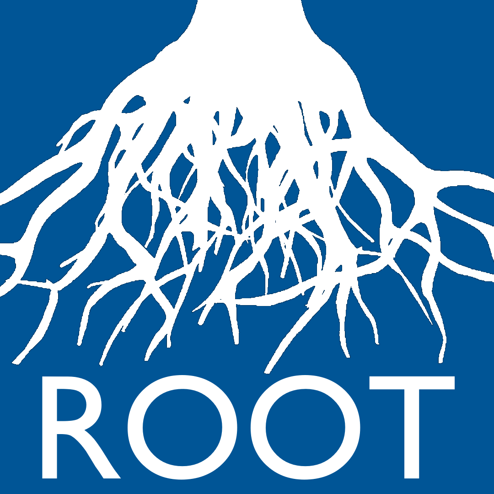

# ROOT - ecosystem services optimization tool

ROOT (Restoration Opportunities Optimization Tool) is a tool to perform optimization and tradeoff analysis. It uses information about the potential biophysical impact of restoration or management change activities together with spatial valuation or serviceshed maps to calculate optimized activity portfolios. Multi-objective analysis allows users to consider how to best manage tradeoffs between different project goals and identify "no-regrets" activity choices that provide relatively high returns across objectives. 